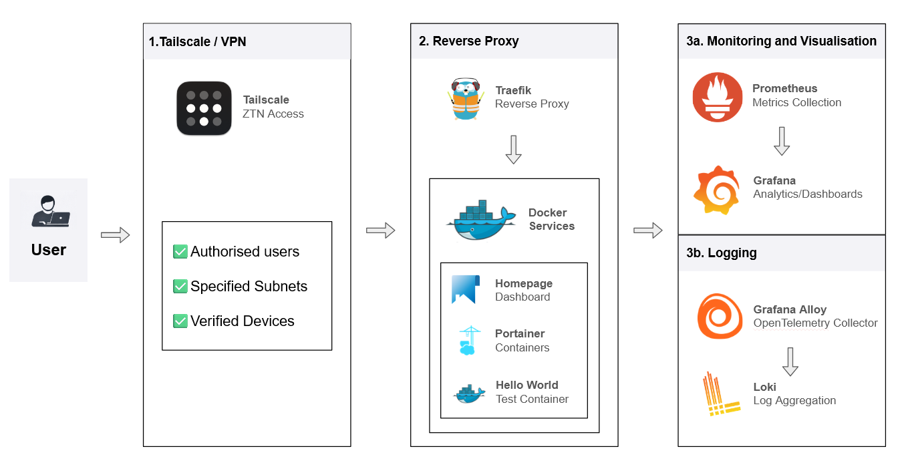

# 🚀 Internal Developer Platform (IDP)

> A self-hosted Internal Developer Platform built in a homelab environment, evolving from manual container management into a self-service platform.

- Deploy and expose services using Docker Compose, Traefik, and GitHub
- Monitor and log platform services with Prometheus, Grafana, Alloy, and Loki
- Designed to evolve into a self-service platform (APIs + UI)

&nbsp;

## 🧠 Why this project exists

This project help:

- Build real infrastructure instead of just studying theory
- Understand how platforms abstract complexity for developers
- Demonstrate real-world DevOps workflows

&nbsp;

## 🏗️ Architecture

&nbsp;

## ✨ Features

- 🌐 Reverse proxy routing via Traefik
- 📦 Containerised services using Docker
- 📊 Monitoring with Prometheus + Grafana
- 📕 Logging with Loki and Alloy
- 🧭 Central dashboard via Homepage
- 🔧 Domain-based service access

&nbsp;

## 🧰 Tech Stack

| Category         | Tools               |
|------------------|---------------------|
| Containers       | Docker              |
| Stack Management | Docker Compose      |
| Reverse Proxy    | Traefik             |
| Monitoring       | Prometheus, Grafana |
| Logging          | Loki, Alloy         |
| Dashboard        | Homepage            |

&nbsp;

## 🧱 Current Services

| Service | Purpose | Access |
|---------|---------|--------|
| Traefik | Reverse proxy and routing | `traefik.idp.labops.uk` |
| Homepage | Platform dashboard | `homepage.idp.labops.uk` |
| Grafana | Dashboards, logs, alerts | `grafana.idp.labops.uk` |
| Prometheus | Metrics collection | Internal |
| Node Exporter | Host metrics | Internal |
| cAdvisor | Container metrics | Internal |
| Loki | Log storage | Internal |
| Alloy | Docker log collection | Internal |
| Hello / Whoami | Demo services | `hello.idp.labops.uk`, `whoami.idp.labops.uk` |

&nbsp;

## 📊 Observability

- **Prometheus** collects system and service metrics  
- **Grafana** provides dashboards for visualisation  
- **Grafana alerting** detects core target, host, and container issues
- **Loki, Alloy** for log aggregation and collection

&nbsp;

## 🧩 Platform Vision

This project is evolving into a **self-service Internal Developer Platform**:

### 🔜 Upcoming Features

- Environment Provisioner API  
  → Create services via API instead of manual deployment  

- DevOps Utility API  
  → Logs, restart, status, health checks  

- Web UI  
  → Self-service platform interface  

&nbsp;

## 🛣️ Roadmap

| Version  | Focus | Status |
|----------|-------|--------|
| V1.0.0   | Foundation: Docker, Traefik, Monitoring, Docs | ✅ Completed |
| V1.1.0   | Logging: Loki + Alloy | ✅ Completed |
| V1.2.0   | Alerting & Reliability | ✅ Completed |
| V1.3.0   | Service Onboarding / Platform UX using Utility API | 🚧 In Progress |
| V1.4.0   | Platform Automation (Environment API, Templates, Standardisation) | ⏳ Planned |
| V1.5.0   | Polish before V2 | ⏳ Planned |
| v2.0.0   | GitOps: CI/CD & Automated Deployments | 🔮 Future |
| V3.0.0   | Kubernetes: k3s Migration | 🔮 Future |

&nbsp;

## 📁 Documentation

Detailed breakdowns available in [`docs/`](./docs):

- Architecture
- Networking
- Traefik configuration
- Monitoring stack
- Deployment process
- Roadmap

&nbsp;

## 🎯 What this demonstrates

- Platform Engineering fundamentals  
- Infrastructure abstraction  
- Observability (metrics + dashboards)  
- Real-world DevOps workflows  

&nbsp;

## ⚠️ Disclaimer

This is a **homelab project** built for learning and demonstration purposes.

&nbsp;

## 🚀 Future Goal

> Build a platform where services are created, deployed, and managed via API/UI — not manually.
